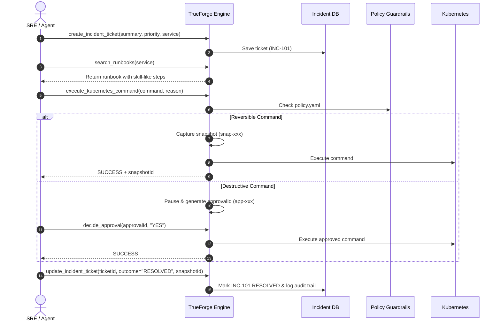

# TrueForge Governed Execution & Incident Management Guide

TrueForge is a safety-first Site Reliability Engineering (SRE) platform and Model Context Protocol (MCP) server. It combines autonomous agent capabilities with strict guardrails, automated pre-flight snapshotting, human approval gates, and in-built incident tracking.

---

## 1. Architecture & Core Capabilities

```
                  ┌──────────────────────────────────────────────┐
                  │          AI Agent / SRE Operator             │
                  └───────────────┬──────────────────────────────┘
                                  │ MCP Tools / REST API
                                  ▼
      ┌──────────────────────────────────────────────────────────────────┐
      │                      TrueForge Engine                            │
      │                                                                  │
      │  [Dynamic Policy Engine]  ──►  Checks config/policy.yaml         │
      │  [Pre-Flight Snapshot]    ──►  Captures K8s state in JSON & DB   │
      │  [Human SRE Approval]     ──►  Halts destructive commands        │
      │  [Incident Tracker]       ──►  In-built SQLite + Jira sync       │
      │  [Audit Log Store]        ──►  Immutable disk & DB event trail   │
      └───────────────────────────┬──────────────────────────────────────┘
                                  │
                  ┌───────────────┴───────────────┐
                  ▼                               ▼
       Kubernetes Cluster (k8s)       In-Built Incident DB (SQLite)
```

### Key Pillars:
1. **Governed Execution:** Every mutating command is evaluated against `config/policy.yaml`.
2. **Automated State Capture:** Before any mutation, a pre-flight snapshot is captured (`snap-<uuid>`).
3. **Destructive Guardrails:** Operations like `delete`, `drain`, `--replicas=0`, or `force` pause execution and require explicit human SRE approval (`YES` / `NO`).
4. **Resilient Incident Tracking:** Live in-built SQLite incident tracker (`INC-101`, `INC-102`, etc.) with zero-dependency uptime and automatic Jira fallback.
5. **Skill-Like Runbooks:** Human-readable operational steps with concrete kubectl commands.

---

## 2. Server Connection & Transports

TrueForge runs on port `3001` (or `$PORT`):

- **Web Dashboard:** `http://localhost:3001`
- **MCP SSE Endpoint:** `http://localhost:3001/sse`
- **MCP Messages Endpoint:** `http://localhost:3001/messages`
- **MCP JSON-RPC / HTTP:** `http://localhost:3001/mcp`
- **REST Endpoints:** `/api/incidents`, `/api/approvals`, `/api/runbooks`, `/api/audit`, etc.

To launch the server locally:
```bash
PORT=3001 npm run dev:sse
```

---

## 3. Essential MCP Tools Reference

### A. Governed Command Execution
#### `execute_kubernetes_command`
Executes any raw or templated `kubectl` command under active policy governance.
- **Parameters:**
  - `command` *(string, required)*: The kubectl command to run (e.g. `kubectl scale deployment payment-service --replicas=3 -n production`).
  - `reason` *(string, required)*: SRE justification for this action.
  - `environment` *(string, required)*: Target environment (`production`, `staging`, `dev`).
  - `targetResource` *(string, optional)*: K8s resource identifier (e.g. `Deployment/payment-service`).
- **Behavior:**
  - If **reversible** (`scale`, `rollout restart`): Automatically captures pre-flight snapshot and executes immediately.
  - If **destructive** (`delete`, `drain`, `--replicas=0`): Captures snapshot, creates a pending approval request (`app-<uuid>`), and pauses with status `APPROVAL_REQUIRED`.
  - If **blocked** (e.g. mutating `kube-system`): Immediately halts with `BLOCKED`.

#### `decide_approval`
Submits a human SRE decision for a paused destructive command.
- **Parameters:**
  - `approvalId` *(string, required)*: The ID returned by `execute_kubernetes_command`.
  - `decision` *(string, required)*: `"YES"` to approve and execute, or `"NO"` to reject.
  - `reason` *(string, optional)*: Review comment or justification.
  - `decidedBy` *(string, optional)*: SRE username / email.

---

### B. Incident Ticket Management
#### `create_incident_ticket`
Creates a ticket in the in-built incident tracking system (and mirrors to Jira if configured).
- **Parameters:**
  - `summary` *(string, required)*: Incident title (e.g. `[P1] payment-service CrashLoopBackOff`).
  - `description` *(string, required)*: Detailed symptoms, logs, or metrics.
  - `priority` *(string)*: `Critical`, `High`, `Medium`, or `Low`.
  - `targetService` *(string)*: Affected microservice name.
  - `environment` *(string)*: Target environment.
- **Returns:** `{ success: true, issueKey: "INC-105", mode: "inbuilt" }`.

#### `update_incident_ticket`
Records a remediation action, verification status, and pre-flight snapshot ID on a ticket.
- **Parameters:**
  - `ticketId` *(string, required)*: Incident ticket ID (e.g. `INC-101`).
  - `outcome` *(string, required)*: `RESOLVED`, `INVESTIGATING`, `ROLLED_BACK`, or `FAILED`.
  - `actionExecuted` *(string)*: Command or runbook executed.
  - `targetResource` *(string)*: Remediated resource.
  - `verificationStatus` *(string)*: Health check verification details.
  - `snapshotId` *(string)*: Pre-flight snapshot ID captured before mutation.
  - `details` *(string)*: Resolution notes.

#### `list_incident_tickets`
Retrieves all incident tickets from the database.
- **Parameters:**
  - `status` *(string, optional)*: Filter by `OPEN`, `INVESTIGATING`, or `RESOLVED`.

---

### C. Runbooks & Manifests
#### `search_runbooks`
Searches available runbooks by query keyword or target service.
- **Parameters:**
  - `query` *(string)*: Search keyword (e.g. `memory`, `restart`, `payment`).
  - `targetService` *(string)*: Service filter.

#### `get_runbook`
Retrieves full details and steps for a specific runbook.
- **Parameters:**
  - `runbookId` *(string, required)*: e.g. `rb-k8s-scale-payment` or `rb-k8s-restart-service`.

#### `save_kubernetes_yaml`
Saves or updates a Kubernetes YAML manifest in `./manifests/`.
- **Parameters:**
  - `filename` *(string, required)*: Manifest file name (e.g. `ingress-patch.yaml`).
  - `content` *(string, required)*: Valid Kubernetes YAML content.

#### `list_kubernetes_yaml`
Lists all Kubernetes YAML manifest files stored in `./manifests/`.

---

## 4. Web UI Dashboard Navigation

Access `http://localhost:3001` in any browser:

| View | Purpose | Key Actions |
| :--- | :--- | :--- |
| **Overview** | System health, integration status, and metrics summary. | Live connection badges for K8s, Prometheus, Grafana, and Incident Tracker. |
| **Runbooks** | Browse and execute skill-like playbooks. | View human-readable steps, runbook risk levels, and automated rollback plans. |
| **K8s Manifests** | Manage Kubernetes resource configurations. | Create, edit, and inspect YAML manifests with syntax highlighting. |
| **Command Runner & Approvals** | Governed interactive terminal & SRE approval queue. | Run raw `kubectl` commands; approve (`YES`) or reject (`NO`) pending destructive actions. |
| **Observability** | Telemetry and synthetic incident simulation. | Trigger test latency anomalies; view Prometheus & Grafana query metrics. |
| **Incident Tickets** | In-built incident table and remediation workbench. | View live table (`INC-101`, `INC-102`, etc.); create tickets; click **Update** to post remediation outcomes. |
| **Audit Logs** | Immutable historical audit trail. | Filter events by action, actor, timestamp, and target resource. |

---

## 5. End-to-End Operator Workflow

When a production incident or SLO degradation occurs:


